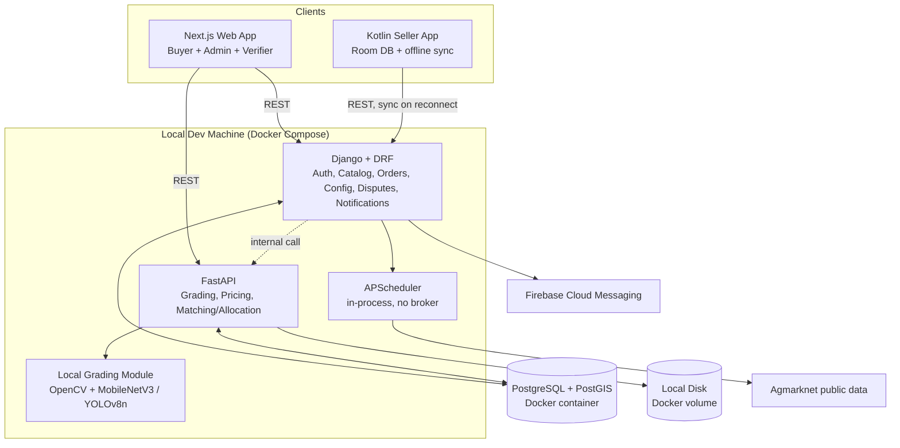
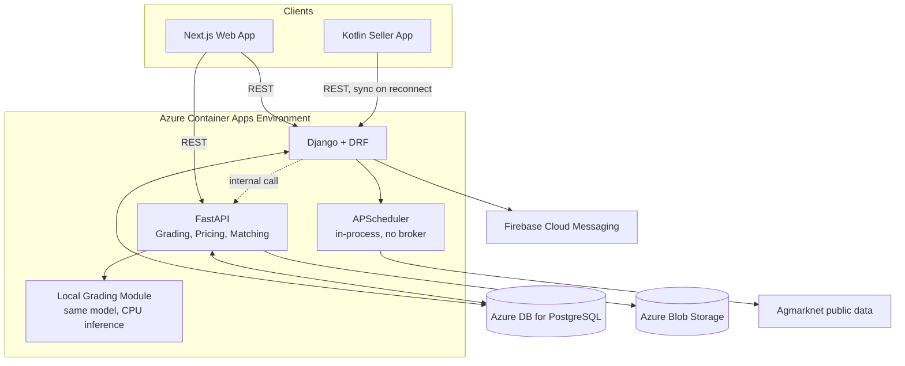

# Build Plan: MSME Multi-Vertical Commodity Marketplace (MVP)

**Scope for this phase:** Agriculture + Textiles verticals only. Solo developer. Personal learning project, built **fully locally, end to end**. No Azure resource is touched until every phase below works completely on your own machine, with nothing hardcoded — Azure is introduced only in a dedicated final production-migration phase, funded by a $100 Azure student credit. ML training and inference run locally on a 6GB VRAM machine and are kept deliberately lightweight. Payments and delivery handoff remain explicitly out of scope (per the original project document).

This plan assumes the plug-in architecture and feature list from `MSME_Marketplace_Project_Document.md` as the source of truth for *what* to build. This document covers *how*.

---

## 1. Tech Stack

| Layer | Choice | Notes |
|---|---|---|
| Web frontend | React + Next.js + TypeScript | Buyer catalog/browsing + Admin/Verifier console in one app, route-gated by role |
| Mobile (seller app) | Kotlin (native Android) | Room DB + WorkManager for offline-first listing creation and background sync |
| Backend — admin/CRUD | Django + Django REST Framework | Auth/RBAC, catalog & order records, dispute workflow, reputation scoring, in-app notifications |
| Backend — compute/ML | FastAPI | Grading (local ML), price calculators, matching/allocation engine; also hosts the in-process scheduler |
| Primary database | PostgreSQL (+ PostGIS extension) | Runs via Docker Compose locally for the entire build; Azure Database for PostgreSQL only enters in the final migration phase |
| Background jobs | APScheduler (in-process) + FastAPI `BackgroundTasks` | Handles scheduled jobs (price ingestion) and async grading calls without any broker or separate worker process. Trade-off: no retry/dead-letter-queue semantics — acceptable at this scale, revisit only if reliability becomes a real problem |
| Search/filtering | Postgres full-text + trigram (`pg_trgm`) | Lightweight, no extra service required; revisit Meilisearch/OpenSearch only if catalog size or filter complexity genuinely grows |
| AI grading (visual attributes only) | Local: OpenCV (edge/color/texture analysis) + a small pretrained model (MobileNetV3 or YOLOv8n via `torchvision`/`ultralytics`) | Runs in-process inside the FastAPI grading service. CPU inference is fine at this volume; comfortably fits a 6GB VRAM budget for any local fine-tuning |
| Non-visual grading attributes | Manual entry (seller), confirmed by Verifier | Moisture %, thread count, GSM, and anything sourced from a document/certificate — never attempted via ML or OCR |
| Object storage | Local disk (Docker volume), abstracted via `django-storages` | Swappable to Azure Blob Storage later purely through settings, no code changes |
| Auth | Django auth + `djangorestframework-simplejwt` | Custom JWT is sufficient at this scale; revisit a managed IdP only if SSO/enterprise buyers become relevant later |
| Notifications | Firebase Cloud Messaging (Android push) + in-app notification panel (web, Postgres-backed `notifications` table, polled) | Matches a mobile-first seller base without requiring WhatsApp/SMS/email integrations |
| i18n | `next-i18next` (web); Android resource strings (mobile) | Text-only multilingual layer for regional-language support |
| CI/CD | GitHub Actions | Free tier (2,000 min/month); test/lint workflows run from the earliest phases, deploy workflows added only at migration time |
| Hosting | Azure Container Apps | Introduced only in the final migration phase |
| Error tracking | Local logging (Python/Django logging) during the build; Sentry (free tier) added at migration time | Keeps the whole build free of third-party cloud dependencies until deployment |

---

## 2. System Architecture

**Local build (the only environment that exists until everything works end to end):**



The only external services touched anywhere in the local build are Agmarknet's public data (agriculture price feed) and Firebase Cloud Messaging (push delivery) — both unavoidable since you can't self-host a government data feed or a push notification gateway, but neither is a paid or Azure dependency.

**Production, once migrated:**



Same shape, same code — only the database, storage backend, and hosting target change. That's the point of abstracting storage via `django-storages` and keeping the ML module fully in-process from the start: the migration is a configuration change, not a rewrite.

Key design point: Django and FastAPI both talk to the same Postgres instance directly (shared schema, not separate databases) — running two backend frameworks is already extra operational surface for a solo dev; two databases would add sync problems for no benefit at this scale.

---

## 3. Repository Structure

A **monorepo** is easier to manage than several separate repos for a solo dev:

```
project/
├── backend-django/
│   ├── config/              # per-vertical schema & pricing rules (JSONB, includes gradeable_by_ml flags)
│   ├── catalog/
│   ├── orders/
│   ├── accounts/
│   ├── disputes/
│   └── notifications/        # in-app notification records + FCM dispatch
├── backend-fastapi/
│   ├── grading/
│   │   └── models/            # local ML: pretrained weights, OpenCV pipeline, inference code
│   ├── pricing/
│   ├── matching/
│   └── scheduler/              # APScheduler jobs (price ingestion etc.), in-process
├── ml-training/                 # notebooks/scripts for fine-tuning the grading model as verifier-confirmed history accumulates
├── web-app/                     # Next.js (buyer + admin + verifier UI)
├── seller-app/                  # Kotlin Android app
├── infra/                       # IaC (Bicep or Terraform) for Azure resources — written at migration time
├── docs/
└── .github/workflows/            # test/lint from the start; deploy workflows added at migration time
```

---

## 4. Database & Vertical Config Design

Core tables (Django-owned, FastAPI reads via the same DB):

- `verticals` — id, name, unit_of_measure, is_active
- `grading_schemas` — vertical_id, attribute definitions as JSONB (name, type, valid range/enum, weight, **`gradeable_by_ml` flag**)
- `pricing_rules` — vertical_id, rule set as JSONB (grade-adjustment table, quantity-tier table)
- `listings` — seller_id, vertical_id, quantity, unit, location (PostGIS point), status
- `grading_evidence` — listing_id, file refs (local disk path / Blob URL later), type
- `grading_results` — listing_id, source (`ai` = local model, or `verifier`), confidence, attribute scores JSONB, timestamp
- `requirements` — buyer_id, vertical_id, quantity, min_grade, budget, region
- `orders` / `order_allocations` — requirement_id, listing_id(s), allocated_quantity, price
- `reputation_scores` — user_id, role, score, last_updated
- `price_points` — vertical_id, commodity, region, price, source, timestamp — this is what the price-feed job writes into
- `notifications` — user_id, type, message, related_object, read_status, created_at — backs the in-app panel and is the source of truth for what gets pushed via FCM

**Concrete plug-in config for the two pilot verticals**, illustrating the schema-as-JSONB approach — note the `gradeable_by_ml` flag on each attribute, which is the actual switch controlling whether that attribute is auto-graded or always manual:

```json
// grading_schemas row for Agriculture (example: wheat)
{
  "vertical": "agriculture",
  "unit": "quintal",
  "attributes": [
    {"name": "moisture_content", "type": "percent", "range": [0, 100], "ideal_max": 12, "gradeable_by_ml": false},
    {"name": "foreign_matter", "type": "percent", "range": [0, 100], "ideal_max": 2, "gradeable_by_ml": true},
    {"name": "grade_standard", "type": "enum", "values": ["FAQ", "Grade A", "Grade B"], "gradeable_by_ml": false}
  ]
}
```

```json
// grading_schemas row for Textiles (example: cotton fabric)
{
  "vertical": "textiles",
  "unit": "meter",
  "attributes": [
    {"name": "gsm", "type": "number", "range": [50, 500], "gradeable_by_ml": false},
    {"name": "thread_count", "type": "number", "range": [50, 1000], "gradeable_by_ml": false},
    {"name": "defect_rate", "type": "percent", "range": [0, 100], "ideal_max": 3, "gradeable_by_ml": true}
  ]
}
```

Adding vertical #3 later is a new row in `grading_schemas` + `pricing_rules` — including which of its attributes are ML-gradeable — not new code. This is the plug-in point working as designed.

---

## 5. Grading Pipeline (Local ML)

1. Seller uploads evidence (photo/video/document) → stored on local disk (Docker volume), abstracted through `django-storages` so the backend can move to Azure Blob Storage later with a settings change only.
2. For each attribute marked `gradeable_by_ml: true` in the vertical's schema, FastAPI's grading service runs the local grading module — OpenCV feature extraction (edge/color/texture analysis) feeding a small pretrained model (MobileNetV3 or YOLOv8n) — as an in-process background task (`FastAPI BackgroundTasks`, no queue or broker).
3. Attributes marked `gradeable_by_ml: false` (moisture %, thread count, GSM) and anything sourced from a document/certificate **always** go straight to manual entry by the seller, confirmed by the Verifier. No ML or OCR is attempted on these.
4. If ML confidence on a visual attribute is below a configurable threshold (start at 80%, tune later) → that attribute is queued for Verifier review instead of going live with the raw estimate.
5. Verifier confirms or overrides in the admin console (Django) → result and override are written to `grading_results` for the audit trail.
6. Document evidence (e.g. purity certificates) is never auto-processed — it's attached as a file, and the Verifier reviews it directly when confirming that attribute's value.

**On the local ML approach:** starting with classical CV plus an off-the-shelf pretrained model means no labeled training data is needed to begin. Expect a fair number of listings to route to the Verifier queue early on, since the model isn't fine-tuned to your specific commodities yet. As verifier-confirmed grading history accumulates in `grading_results`, that becomes your training set for fine-tuning the pretrained model — or training a small CNN from scratch — turning the audit trail into a self-improving feedback loop for the grading engine.

**Hardware note:** MobileNetV3-small and YOLOv8n both comfortably fit a 6GB VRAM budget for any local fine-tuning, and run fine on CPU too for single-image, low-throughput inference. Worth benchmarking actual latency once you have real evidence photos, but it shouldn't be a bottleneck at pilot scale.

---

## 6. Market Price Data — What's Actually Available

**Agriculture:** [Agmarknet](https://agmarknet.gov.in) (Government of India, Ministry of Agriculture) publishes daily mandi-wise arrivals and prices for most agricultural commodities, including raw cotton (kapas) as an agri commodity. No official public REST API is guaranteed stable long-term — plan to build a scheduled scraper/downloader against their published data exports (an APScheduler job, in-process, no broker needed), with the ingestion job isolated behind an interface so it can be swapped for e-NAM or a paid data vendor without touching the rest of the system.

**Textiles:** this is the harder one, and worth being upfront about. There is no equivalent daily public price index for *finished* textile goods (fabric, GSM-graded cloth) — wholesale textile pricing is largely negotiated, not centrally published. What does exist:
- Raw cotton (the input commodity) has price signals via **NCDEX** (futures/spot, largely exchange-gated) and **Cotton Corporation of India (CCI)** procurement/MSP data.
- Finished-goods pricing (fabric by GSM/thread count) has no public feed.

**Recommendation:** for the textiles vertical specifically, treat raw cotton price as a directional reference feed (via CCI/NCDEX public disclosures) but keep the actual "base price" for finished fabric listings as **admin-entered/seller-negotiated**, clearly labeled as such in the UI rather than presented as a live market feed. Trying to fake a live feed you don't actually have would undermine the "price opacity" problem the whole project exists to solve. This is worth a dedicated research spike before you build the price calculator UI for textiles.

---

## 7. Local Development Setup, and Later Azure Migration (against your $100 credit)

**During the entire build, no Azure resource is touched.** Everything runs via Docker Compose on your machine: Postgres+PostGIS, Django, FastAPI. Media files live on a local Docker volume. The local ML model runs in-process inside FastAPI. The only external calls anywhere in the stack are to Agmarknet's public data and Firebase Cloud Messaging — neither is Azure, so the $100 credit stays fully untouched until you deliberately begin the migration phase.

**When you do move to Azure, at the end:**

| Resource | Tier | Approx. cost during pilot | Notes |
|---|---|---|---|
| Azure Database for PostgreSQL – Flexible Server | Burstable B1MS | **Free for 12 months** if this Azure subscription hasn't used its free-account benefit (750 hrs/month + 32GB storage/backup included); otherwise roughly $12–15/month | Check free-account eligibility first — this alone could cover your whole pilot's DB cost |
| Azure Container Apps (Django + FastAPI — no separate worker container needed) | Consumption plan | Likely **$0/month** at pilot traffic | Only 2 services to run, since there's no Celery worker; 180,000 vCPU-seconds, 360,000 GiB-seconds, and 2M HTTP requests are free every month, forever |
| Azure Blob Storage | Standard, LRS | ~$1–3/month | Grading evidence — images/short videos/PDFs at low volume |
| GitHub Actions (CI/CD) | Free tier | $0 | Deploy workflows added at migration time; test/lint workflows already exist from earlier in the build |

**Bottom line:** a lean pilot for 2 verticals should run **well under $15/month** on Azure once you're there, meaning the $100 credit can cover many months of runway if you stay on free/burstable tiers. The main way to blow through it faster is over-provisioning compute "just in case" — resist that until you have real usage data. Re-check exact current pricing in the Azure Pricing Calculator before committing, since Microsoft revises these numbers periodically and regional (India) pricing can differ from general figures.

**One thing to validate before migrating:** Azure Container Apps' Consumption plan has no GPU. The local ML model needs to run on CPU in production. Very likely fine given the lightweight model choice, but worth explicitly checking inference latency after migration rather than assuming it carries over identically from a more capable dev machine.

---

## 8. Solo-Dev Phased Roadmap

Being honest about scope: this is a lot of surface area (two backend frameworks, a native mobile app, a self-built AI grading pipeline, live external data feeds) for one person. Sequencing matters more than usual here — build in a straight line, don't parallelize across all codebases at once. **No phase below touches Azure in any way.**

**Phase 0 — Foundations (1–2 weeks)**
- Repo scaffold, Django + FastAPI skeletons
- Postgres + PostGIS via Docker Compose
- Auth (JWT), role-based permissions for the 4 roles (Seller, Buyer, Admin, Verifier)
- Local media storage (Django `MEDIA_ROOT` + Docker volume) for grading evidence

**Phase 1 — Catalog core, web only (2–3 weeks)**
- Vertical config console (Django admin, or a lightly customized DRF + Next.js form) for Agriculture + Textiles schemas, including `gradeable_by_ml` flags per attribute
- Listing creation, catalog browsing/filtering (buyer web flow)
- No grading AI yet — grade fields are manually entered to unblock everything downstream

**Phase 2 — Grading pipeline (2–3 weeks, budget extra time for ML iteration)**
- Evidence upload → local disk
- OpenCV + lightweight pretrained model (MobileNetV3/YOLOv8n) grading module, in-process via FastAPI `BackgroundTasks`, for `gradeable_by_ml: true` attributes only
- Manual entry for moisture/thread-count/GSM and all document-based attributes — no OCR attempted
- Confidence threshold + Verifier queue + override flow, audit trail

**Phase 3 — Pricing (1–2 weeks)**
- Agmarknet ingestion as an APScheduler scheduled job (in-process, no broker)
- Textiles pricing UI shipped as admin-entered (per §6) — don't block this phase on solving the textiles data problem
- Grade-adjusted + quantity-tiered price calculators

**Phase 4 — Matching & allocation (2–3 weeks)**
- Buyer requirement posting
- Matching engine (grade/quantity/region)
- Multi-listing allocation algorithm — the most algorithmically nontrivial piece; budget real time for it
- Bid/negotiation, order finalization

**Phase 5 — Seller mobile app (3–4 weeks, can start in parallel once Phase 1's API is stable)**
- Kotlin app, Room DB, offline listing creation + WorkManager sync against the Django API
- FCM SDK integration + push token registration (full delivery wiring happens in Phase 6)

**Phase 6 — Trust, i18n, notifications, polish**
- Reputation scoring, trust-weighted allocation
- Multilingual text layer (`next-i18next` + Android resource strings)
- Notifications: FCM push (mobile) + in-app notification panel (web), backed by the `notifications` table, simple polling by default

**Only after every phase above works fully, end to end, with nothing hardcoded:**

**Phase 7 — Azure Production Migration**
- Swap Postgres (Docker) → Azure Database for PostgreSQL Flexible Server
- Swap local disk storage → Azure Blob Storage (via `django-storages` — no app code changes needed, just settings)
- Deploy Django + FastAPI to Azure Container Apps
- Write infra-as-code (Bicep or Terraform) now, not before
- Validate the local ML model's CPU inference latency in the container environment (no GPU on the Consumption plan)
- Add deploy workflows to GitHub Actions
- Add Sentry for error tracking

---

## 9. Open Items to Revisit

- **Textiles price feed** — needs a research spike before Phase 3 (see §6); don't let it block the calculator UI.
- **Web notification delivery mechanism** — defaulting to simple polling for the in-app panel; revisit WebSocket/SSE only if it feels laggy in practice.
- **CPU inference latency for the local ML model once containerized on Azure** — validate before Phase 7, don't assume it carries over identically from a local dev machine.
- **Local ML model accuracy** — expect a high proportion of listings to route to the Verifier queue early on, since the model starts with no fine-tuning on your specific commodities. This should improve as verifier-confirmed grading history accumulates and you fine-tune against it.
- **Document OCR** — explicitly skipped at MVP; certificates go straight to the Verifier as file attachments. Revisit local OCR (Tesseract/EasyOCR) only if manual document review becomes an actual bottleneck.
- **Search at scale** — Postgres trigram search is fine for 2 verticals/low listing volume; revisit Meilisearch/OpenSearch once catalog size or filter complexity genuinely grows.
- **Payments & delivery handoff** — intentionally unbuilt per the original doc; nothing to do here yet, just don't let scope creep in.
